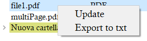

# flashcards-from-pdf

This project started out to shorten the amount of time needed to create flashcards.

## Idea

In most classes, the material provided consists of many slides in which there are a few phrases per page or other forms of PDF. Instead of creating flashcards from scratch with question and answer, this tool anchors the question to a PDF page.  
The advantage is that it can update automatically the flashcards when new annotations are added to the material. This is not possible with static screenshots that are pasted into an already existing flashcard software.
This is particularly useful when notes are taken on a tablet, so new scribbles are added continuously.  
This tool lets you update the flashcards with little effort, so you don't have to test yourself on static flashcards and then check again the slides to see if text was added afterward.
The flashcards created can be seen on this application or it is possible to export them to Anki.

## Typical pipeline

-   1.  -   1. take notes on the tablet during lesson
        -   2. a PDF copy of the notes is automatically saved on all devices using for example Dropbox, OneDrive, Google Drive, ....
-   2. copy the new backup files in the `data/` folder
-   3. open the PDF file in the application with a double click and add the flashcards
-   4. create a txt file in `data/Anki/` using the "Export to txt" option in the right-click panel  
       
-   5. import the text file in Anki

When new content is added on the tablet:

-   6. update the pdf/folder using the update option in the right-click panel  
       
-   7. redo steps iv and v

## More details

The flashcards can be page-specific or generic. A page-specific flashcard will also have the pdf page on the back of the flashcard. A generic flashcard could be positioned at the start using "Add generic flashcard at the beginning" or before a specific page.  
A generic flashcard could have an answer or not. For example, a flashcard could only be put before a certain page to say something to the reader.
A flashcard can be specific to a page and have an answer that can be used to specify something.
The reference pdf page of a flashcard is the one visualized on the screen. If it is currently visualized a flashcard, then the reference page of the new flashcard will be the same and it will be inserted immediately before.

Flashcards are anchored to the pdf pages using their page number. So if the page number of a page changes when updating the pdf, then the flashcard will point to a different page. Often some pages will be added or removed, rarely swapped. For this reason, under "Advanced options", there are commands that can move ahead all the flashcards from a certain point and so on.

There is the possibility to see the flashcards in a random order using the "Shuffle" button. In this mode, it is possible to signal that you know the flashcard or not with the button at the bottom.
Only the first pass result of a test is saved as a completed task. So if there are 10 flashcards and in the first trial you complete 6 of those, it is going to be save 60.0. Then the flashcards that were not completed the first time will be visualized again until all of them are responded correctly, but these results will not be saved.
Afterwards, there is the possibility to start a new test and the first result will be saved again.

It is possible to export the flashcards to a txt file that is compatible with Anki. The txt file has to be imported manually in Anki and it is saved in data\Anki. The PDF pages related to a flashcard are converted to jpg and saved in the media directory of Anki. The same relative path of the PDF is copied in the jpg filename in data\Anki.

## Configuration

In the `data/` folder there are some configuration files that need to be changed before the first execution of the program.

-   private_pdf_folder.txt -> default path opened when updating a file/folder
-   private_folder_anki.txt -> path to Anki [collection.media](https://docs.ankiweb.net/files.html)

## Attention!

The `.txt` files that are created in the `data/` folder contain the flashcards, so it is suggested to periodically backup them and not delete them.  
Some configuration files should not be removed from the folder.
These files are: `private_log_file.txt`, `private_folder_anki.txt`, `private_pdf_folder.txt`, and `private_flashcards_from_pdf.db`.

## Shortcuts

| Shortcut                   | Action                                              |
| -------------------------- | --------------------------------------------------- |
| Ctrl++                     | Zoom in PDF                                         |
| Ctrl+-                     | Zoom out PDF                                        |
| Ctrl+G                     | Focus on spinbox                                    |
| Ctrl+Q                     | Focus on advanced options                           |
| Ctrl+E                     | Edit current flashcard                              |
| Ctrl+A                     | Focus on question text input(A = Add new flashcard) |
| Ctrl+S / Ctrl+Return       | Add/modify flashcard                                |
| Ctrl+Shift+S / Ctrl+Return | Add/modify generic flashcard                        |
| Ctrl+D                     | Remove current flashcard (D = delete)               |
| Ctrl+R                     | Cancel current flashcard (R = Redo)                 |
| Up arrow                   | Previous page                                       |
| Down arrow                 | Next page                                           |
| Left arrow                 | Previous card                                       |
| Right arrow                | Next card                                           |
| Ctrl+Left arrow            | Previous flashcard                                  |
| Ctrl+Right arrow           | Next flashcard                                      |

## Requirements

Tested with:

-   Python 3.10.12
-   matplotlib 3.7.2
-   numpy 1.25.2
-   pandas 2.0.3
-   scikit-learn 1.3.0
-   pyqt6 6.5.2
-   poppler 22.12.0
-   pdf2image 1.16.3

To create the binaries:

-   pyinstaller 5.6.2

## Packaging

```bash
pyinstaller --add-data data;data -p src src\main.py
```

## Technical details

The `.txt` files that contain the flashcards are formatted in this way:  
The first information is the number of completed tests on the flashcards in this file. Then for every completed attempt, there is the date in which it was completed and the ratio of the flashcards completed at the first attempt to the number of flashcards.  
There is a row that is at 1 if there is an ongoing test and at 0 otherwise.  
Then there is a number that corresponds to the number of flashcards and finally, there are the flashcards. They are ordered by num_page.  
The flashcards that are generic to the deck and do not have a corresponding PDF page are stored with a negative num_page.  
The last but one field contains n digits that are the outcome of the previous response sessions. 1 means that the flashcard was known and 0 represents the opposite. For example, 100 means that the first time the response was correct and that the last two times the responses were not remembered.  
Finally, there is the result of the ongoing test. If there is no ongoing test this field should be not considered.

num_completed_tests  
datetime1_completed ?^? percentage_correct_first_try ?^?  
datetime2_completed ?^? percentage_correct_first_try ?^?  
....  
first_pass_flag['0'=false|'1'=true]  
num_flashcards  
num_page ?^? question ?^? answer['!-!'= no answer] ?^? type['g'=generic|'p'=page_specific] ?^? 100 ?^? ongoing_test_result['0'=mistake|'1'=not_done|'2'=correct][optional]?^?

The datetimes are saved in the "yyyy/mm/dd_HH:MM:SS" format.

The reference page index is in 1-based format because in this way a user can read a TXT file and make sense of it. It can be useful when a PC is not available, so you do not have access to this software, but you can visualize the TXT files(e.g. on OneDrive, ...). In the codebase, the index of a PDF page is saved and used in a 0-based format.  
There is always a +1 in the visualization process. So in the TXT, a generic page has as index of -1, and internally it is stored -2.
